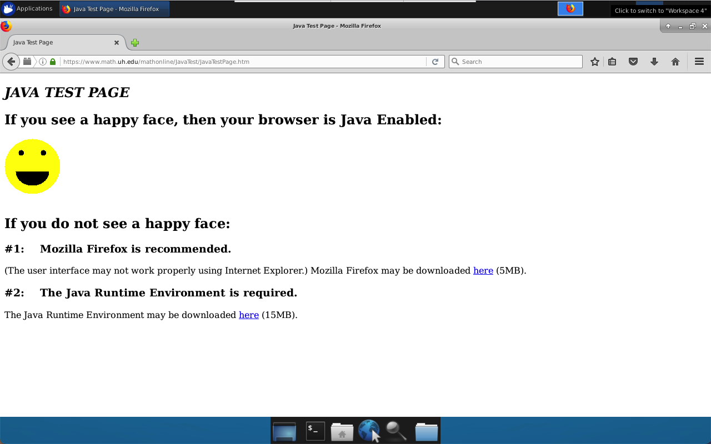

# Docker Java Applets (Legacy Access)

A lightweight Docker container with XFCE, VNC, Firefox 45 ESR, and Java plugin support for running legacy Java applets.

This project makes it easy to access old-school Java-based tools like **IPMI**, **iDRAC**, and other remote KVM consoles. It runs an Ubuntu 18.04 desktop with Firefox 45 ESR (the last version to support NPAPI plugins) and Java 8, all inside a VNC-accessible container — so you don’t have to mess with your host setup.

## Screenshot

<table><tr><td>
    
</td></tr></table>

## Quick Start

You can get up and running with just a few commands:

```bash
git clone https://github.com/heroseloi/docker-java-apples.git
cd docker-java-apples
chmod +x run.sh
./run.sh
```

Then connect to the desktop using your VNC client:

```bash
localhost:5901
```

**Password: docker**

**Important:**

Please ensure that the websites or network mask you wish to access are added to the file **java_config/exception.sites** prior to building it.

Wepages used for testing:

https://www.math.uh.edu/mathonline/JavaTest/JavaTestPage.htm

https://www.w3.org/People/mimasa/test/object/java/


## Features
- Ubuntu 18.04 base  
- XFCE lightweight desktop  
- VNC server for remote GUI access  
- Firefox 45 ESR with NPAPI support  
- Java 8 with browser plugin (`libnpjp2.so`)  
- Custom desktop shortcut for easy access

## Notes
- Designed mainly for legacy tools like KVM/IPMI/iDRAC consoles that still use Java applets.
- Uses Firefox 45 ESR – the last version with full Java NPAPI plugin support.
- Tested on macOS with Docker Desktop and RealVNC client.
